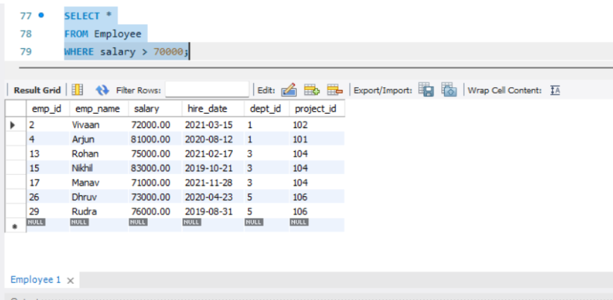
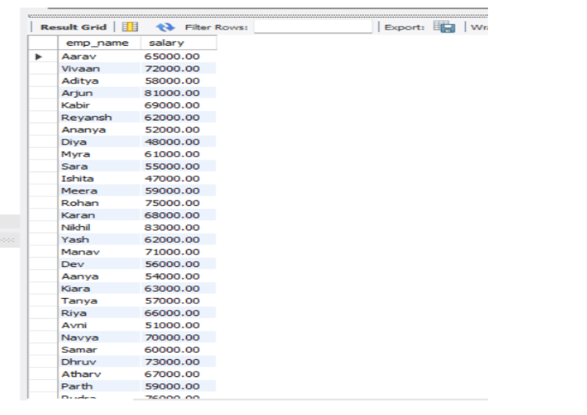
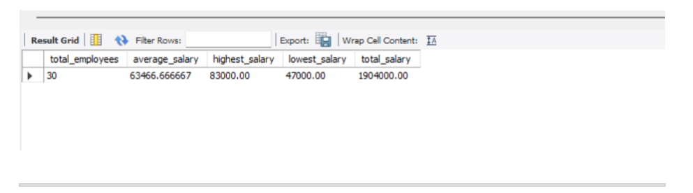
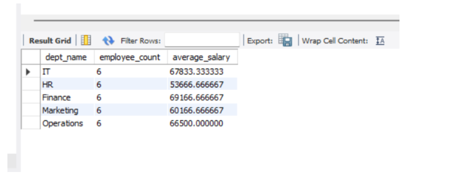
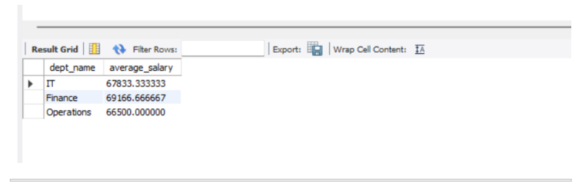
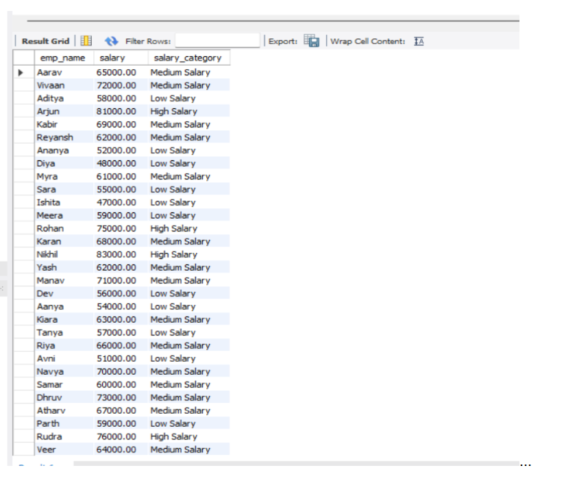
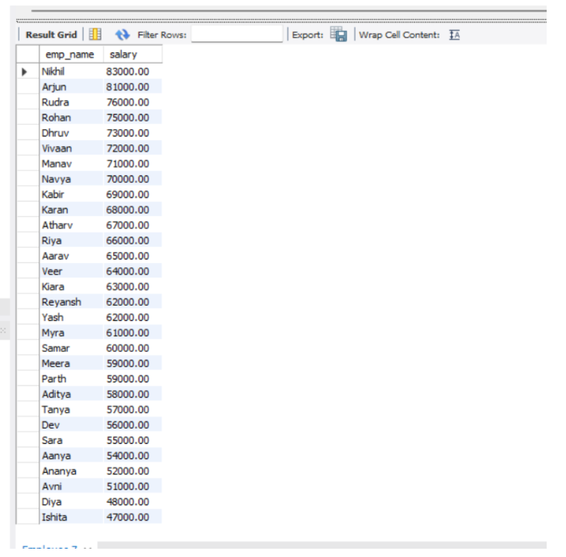
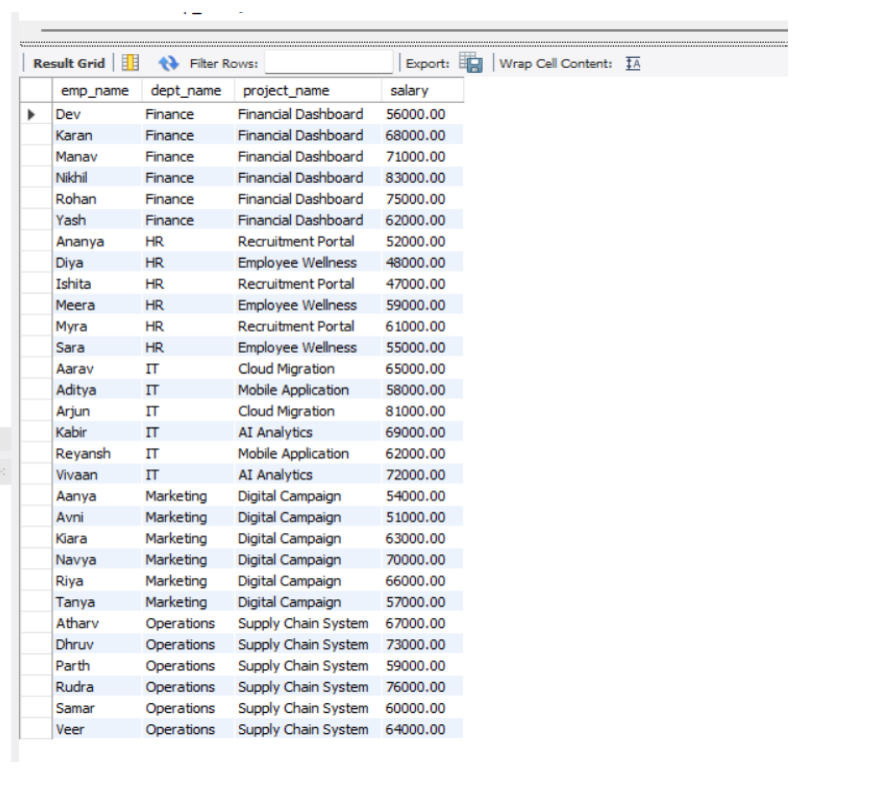

# DBMS Experiment – 3

## Employee–Department–Project Relational Database

---

## 🎯 Aim

To create an Employee–Department–Project relational database, insert at least 30 employees across 5 departments and 8 projects, and demonstrate SQL queries using Selection, Projection, Aggregate Functions, GROUP BY, HAVING, CASE expressions, and ORDER BY.

---

## 🗂️ Database Structure

The database consists of three tables.

### 1. Department

Stores information about different departments.

**Attributes:**
- Department ID
- Department Name

**Departments:**
- IT
- HR
- Finance
- Marketing
- Operations

### 2. Project

Stores information about different projects.

**Attributes:**
- Project ID
- Project Name
- Budget
- Department ID

**Projects:**
- Cloud Migration
- AI Analytics
- Recruitment Portal
- Financial Dashboard
- Digital Campaign
- Supply Chain System
- Mobile Application
- Employee Wellness

### 3. Employee

Stores information about employees.

**Attributes:**
- Employee ID
- Employee Name
- Salary
- Hire Date
- Department ID
- Project ID

The database contains **30 employees** distributed across the five departments.

---

# 💻 SQL Queries and Outputs

## 1. Selection

### Description

Selection is used to retrieve records that satisfy a particular condition.

In this experiment, employees whose salary is greater than 70,000 are displayed.

### Query

```sql
SELECT *
FROM Employee
WHERE salary > 70000;
```

### 📌 Output



---

## 2. Projection

### Description

Projection is used to display only the required columns from a table.

In this experiment, employee names and salaries are displayed.

### Query

```sql
SELECT emp_name, salary
FROM Employee;
```

### 📌 Output



---

## 3. Aggregate Functions

### Description

Aggregate functions are used to perform calculations on employee data.

The following aggregate functions are demonstrated:

| Function | Purpose |
|---|---|
| `COUNT()` | Finds the total number of employees |
| `AVG()` | Calculates the average salary |
| `MAX()` | Finds the highest salary |
| `MIN()` | Finds the lowest salary |
| `SUM()` | Calculates the total salary |

### Query

```sql
SELECT
    COUNT(*) AS total_employees,
    AVG(salary) AS average_salary,
    MAX(salary) AS highest_salary,
    MIN(salary) AS lowest_salary,
    SUM(salary) AS total_salary
FROM Employee;
```

### 📌 Output



---

## 4. GROUP BY

### Description

`GROUP BY` is used to group records based on a particular column.

In this experiment, employees are grouped according to their departments to find the number of employees and average salary in each department.

### Query

```sql
SELECT
    d.dept_name,
    COUNT(e.emp_id) AS employee_count,
    AVG(e.salary) AS average_salary
FROM Department d
JOIN Employee e
ON d.dept_id = e.dept_id
GROUP BY d.dept_id, d.dept_name;
```

### 📌 Output



---

## 5. HAVING

### Description

`HAVING` is used to filter groups created using `GROUP BY`.

In this experiment, departments whose average salary is greater than 65,000 are displayed.

### Query

```sql
SELECT
    d.dept_name,
    AVG(e.salary) AS average_salary
FROM Department d
JOIN Employee e
ON d.dept_id = e.dept_id
GROUP BY d.dept_id, d.dept_name
HAVING AVG(e.salary) > 65000;
```

### 📌 Output



---

## 6. CASE Expression

### Description

A `CASE` expression is used to classify employees according to their salary.

**Salary categories:**
- **High Salary** – Salary greater than or equal to 75,000
- **Medium Salary** – Salary greater than or equal to 60,000
- **Low Salary** – Salary below 60,000

### Query

```sql
SELECT
    emp_name,
    salary,
    CASE
        WHEN salary >= 75000 THEN 'High Salary'
        WHEN salary >= 60000 THEN 'Medium Salary'
        ELSE 'Low Salary'
    END AS salary_category
FROM Employee;
```

### 📌 Output



---

## 7. ORDER BY

### Description

`ORDER BY` is used to arrange records in a specific order.

In this experiment, employees are displayed in descending order of salary.

### Query

```sql
SELECT emp_name, salary
FROM Employee
ORDER BY salary DESC;
```

### 📌 Output



---

## 8. JOIN – Employee, Department and Project

### Description

`JOIN` is used to combine related information from multiple tables.

In this experiment, the Employee, Department, and Project tables are joined to display employee name, department, project, and salary.

### Query

```sql
SELECT
    e.emp_name,
    d.dept_name,
    p.project_name,
    e.salary
FROM Employee e
JOIN Department d
ON e.dept_id = d.dept_id
JOIN Project p
ON e.project_id = p.project_id
ORDER BY d.dept_name, e.emp_name;
```

### 📌 Output



---

# 📚 SQL Concepts Demonstrated

The experiment demonstrates:

1. Selection
2. Projection
3. Aggregate Functions
4. GROUP BY
5. HAVING
6. CASE Expression
7. ORDER BY
8. JOIN

---

# ✅ Result

The Employee–Department–Project relational database was successfully created with:

- **30 Employees**
- **5 Departments**
- **8 Projects**

The required SQL operations were successfully demonstrated.

---

# 📝 Conclusion

This experiment provides practical understanding of relational database operations. It demonstrates how SQL can be used to retrieve, select, group, filter, classify, sort, and combine data from related tables.

---

# 📸 Output Screenshots

All output screenshots are stored inside the `images` folder.

| No. | Query | Image File |
|---:|---|---|
| 1 | Selection | `01_selection_output.png` |
| 2 | Projection | `02_projection_output.png` |
| 3 | Aggregate Functions | `03_aggregate_output.png` |
| 4 | GROUP BY | `04_groupby_output.png` |
| 5 | HAVING | `05_having_output.png` |
| 6 | CASE Expression | `06_case_output.png` |
| 7 | ORDER BY | `07_orderby_output.png` |
| 8 | JOIN | `08_join_output.png` |

---

## 📁 Project Structure

```text
DBMS-LAB_FILE/
│
├── images/
│   ├── 01_selection_output.png
│   ├── 02_projection_output.png
│   ├── 03_aggregate_output.png
│   ├── 04_groupby_output.png
│   ├── 05_having_output.png
│   ├── 06_case_output.png
│   ├── 07_orderby_output.png
│   └── 08_join_output.png
│
├── exp03.sql
└── readme.md
```

---

## 🔗 Output Image Path

The images are linked using relative paths, for example:

```text
images/01_selection_output.png
```

Therefore, GitHub will automatically display each screenshot when the corresponding image exists inside the `images` folder.
