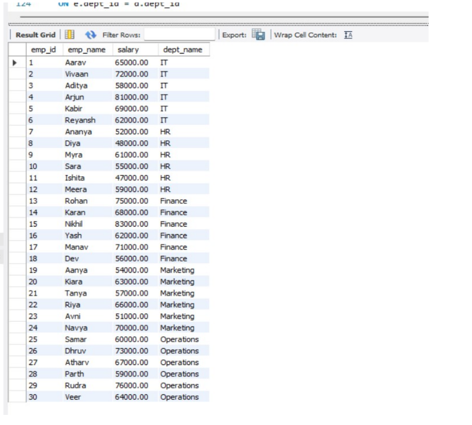
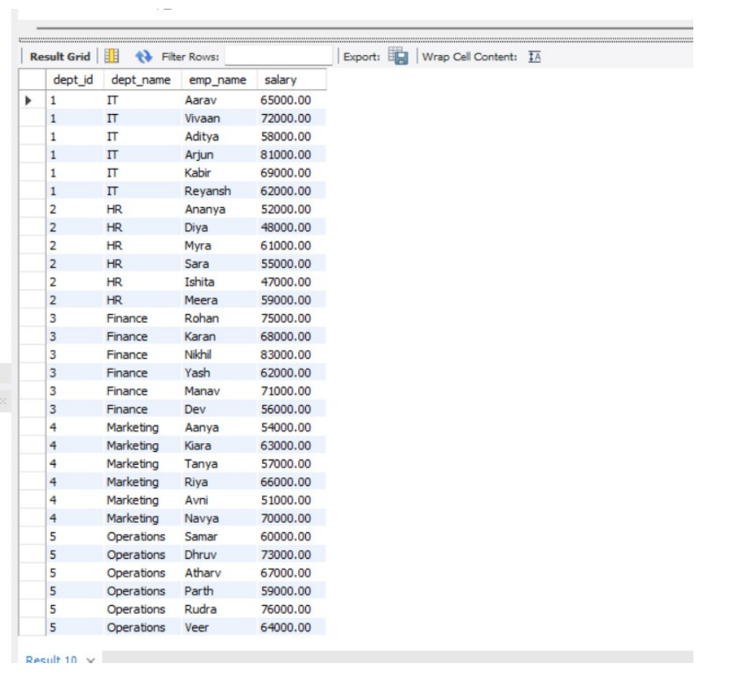
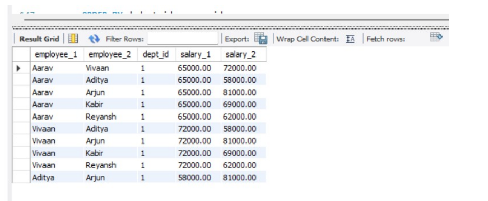
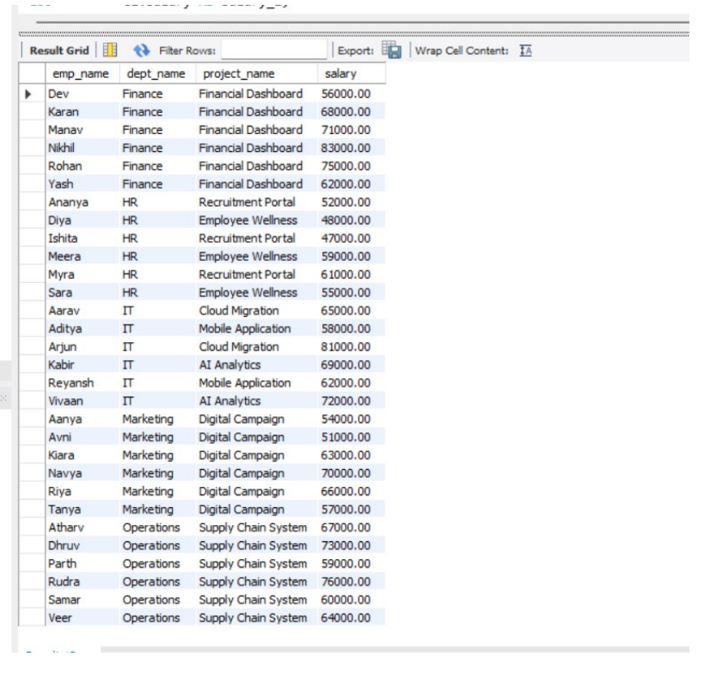
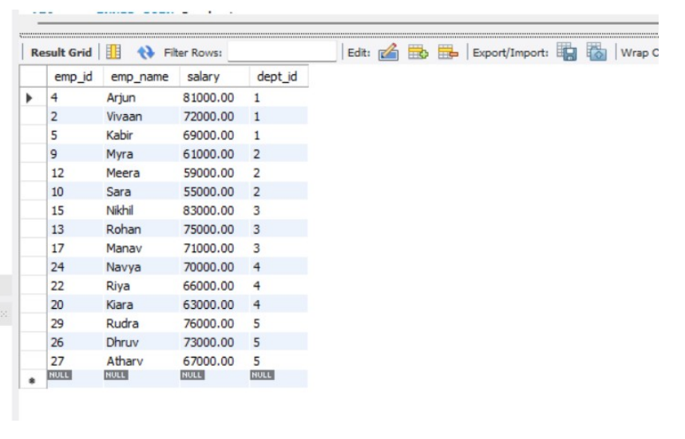
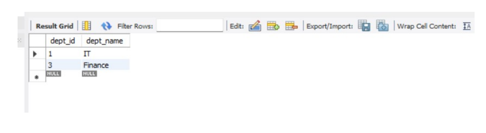
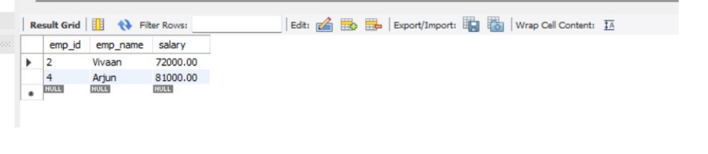
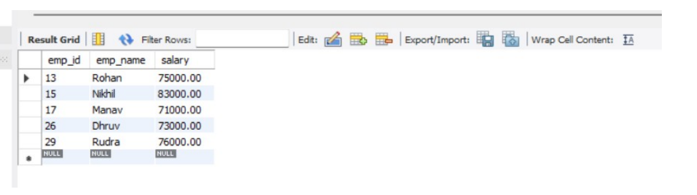
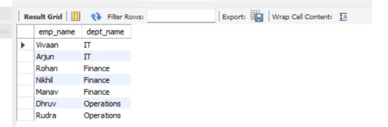
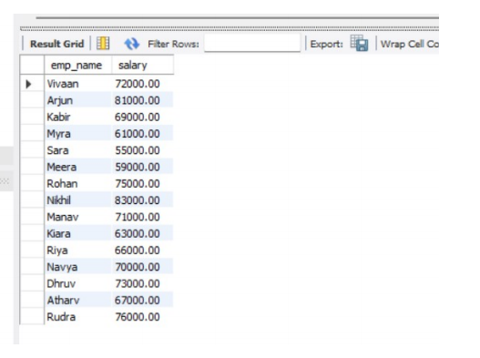

# DBMS Experiment – 4

## Employee–Department–Project Database

---

## 🎯 Aim

Using the Employee schema, write and execute SQL queries with **INNER JOIN, LEFT JOIN, self-join, 3-way JOIN, correlated subqueries, EXISTS, simulated INTERSECT and EXCEPT**. Compare the execution plans of selected queries using `EXPLAIN`.

---

## 📌 Objectives

- Understand different types of JOIN operations and how they combine rows from related tables.
- Perform a self-join on the Employee table to compare employees within the same department.
- Use correlated subqueries and `EXISTS` for row-by-row and existence-based filtering.
- Simulate `INTERSECT` and `EXCEPT` operations using MySQL-supported subqueries.
- Inspect and compare query execution plans using `EXPLAIN`.

---

## 🗄️ Database Used

The queries use the **CompanyDB** database and the Employee–Department–Project schema.

The database contains:

- **30 Employees**
- **5 Departments**
- **8 Projects**

### Main Tables

| Table | Important Columns | Relationship |
|---|---|---|
| Employee | `emp_id`, `emp_name`, `salary`, `hire_date`, `dept_id`, `project_id` | `dept_id → Department`, `project_id → Project` |
| Department | `dept_id`, `dept_name` | Primary Key: `dept_id` |
| Project | `project_id`, `project_name`, `budget`, `dept_id` | Primary Key: `project_id`, `dept_id → Department` |

---

# 💻 SQL Queries and Outputs

## 1. INNER JOIN

### Description

`INNER JOIN` combines rows from Employee and Department where the department IDs match.

### Query

```sql
SELECT
    e.emp_id,
    e.emp_name,
    e.salary,
    d.dept_name
FROM Employee e
INNER JOIN Department d
    ON e.dept_id = d.dept_id
ORDER BY e.emp_id;
```

### 📌 Output



---

## 2. LEFT JOIN

### Description

`LEFT JOIN` returns every department from the Department table, along with matching employees. If a department has no employee, the employee columns would contain `NULL`.

### Query

```sql
SELECT
    d.dept_id,
    d.dept_name,
    e.emp_name,
    e.salary
FROM Department d
LEFT JOIN Employee e
    ON d.dept_id = e.dept_id
ORDER BY d.dept_id, e.emp_id;
```

### 📌 Output



---

## 3. SELF-JOIN

### Description

A self-join joins the Employee table with itself to compare two employees belonging to the same department.

The condition `e1.emp_id < e2.emp_id` prevents an employee from being paired with themselves and avoids duplicate reverse pairs.

### Query

```sql
SELECT
    e1.emp_name AS employee_1,
    e2.emp_name AS employee_2,
    e1.dept_id,
    e1.salary AS salary_1,
    e2.salary AS salary_2
FROM Employee e1
INNER JOIN Employee e2
    ON e1.dept_id = e2.dept_id
    AND e1.emp_id < e2.emp_id
ORDER BY e1.dept_id, e1.emp_id, e2.emp_id
LIMIT 10;
```

### 📌 Output



---

## 4. 3-WAY JOIN

### Description

A 3-way JOIN combines the Employee, Department, and Project tables to display employee name, department, project, and salary.

### Query

```sql
SELECT
    e.emp_name,
    d.dept_name,
    p.project_name,
    e.salary
FROM Employee e
INNER JOIN Department d
    ON e.dept_id = d.dept_id
INNER JOIN Project p
    ON e.project_id = p.project_id
ORDER BY d.dept_name, e.emp_name;
```

### 📌 Output



---

## 5. CORRELATED SUBQUERY

### Description

A correlated subquery refers to a column from the outer query.

This query displays employees whose salary is greater than the average salary of their own department.

### Query

```sql
SELECT
    e.emp_id,
    e.emp_name,
    e.salary,
    e.dept_id
FROM Employee e
WHERE e.salary > (
    SELECT AVG(e2.salary)
    FROM Employee e2
    WHERE e2.dept_id = e.dept_id
)
ORDER BY e.dept_id, e.salary DESC;
```

### 📌 Output



---

## 6. EXISTS

### Description

`EXISTS` checks whether at least one matching row exists in a subquery.

This query finds departments having at least one employee with a salary greater than 80,000.

### Query

```sql
SELECT
    d.dept_id,
    d.dept_name
FROM Department d
WHERE EXISTS (
    SELECT 1
    FROM Employee e
    WHERE e.dept_id = d.dept_id
      AND e.salary > 80000
)
ORDER BY d.dept_id;
```

### 📌 Output



---

## 7. SIMULATED INTERSECT

### Description

The intersection of two employee sets is simulated by requiring an employee ID to occur in both subqueries.

Here the two sets are employees in IT and employees whose salary is greater than 70,000.

### Query

```sql
SELECT emp_id, emp_name, salary
FROM Employee
WHERE emp_id IN (
    SELECT emp_id
    FROM Employee
    WHERE dept_id = 1
)
AND emp_id IN (
    SELECT emp_id
    FROM Employee
    WHERE salary > 70000
)
ORDER BY emp_id;
```

### 📌 Output



---

## 8. SIMULATED EXCEPT

### Description

EXCEPT is simulated by selecting employees with salary greater than 70,000 while excluding employees belonging to IT.

### Query

```sql
SELECT emp_id, emp_name, salary
FROM Employee
WHERE emp_id IN (
    SELECT emp_id
    FROM Employee
    WHERE salary > 70000
)
AND emp_id NOT IN (
    SELECT emp_id
    FROM Employee
    WHERE dept_id = 1
)
ORDER BY emp_id;
```

### 📌 Output



---

# 9. EXPLAIN – Execution Plan

`EXPLAIN` shows how the MySQL optimizer intends to execute a SELECT query. It can be used to inspect access type, possible indexes, selected indexes, estimated rows, and additional operations.

## A. EXPLAIN for INNER JOIN

```sql
EXPLAIN
SELECT
    e.emp_name,
    d.dept_name
FROM Employee e
INNER JOIN Department d
    ON e.dept_id = d.dept_id
WHERE e.salary > 70000;
```

### 📌 Output



---

## B. EXPLAIN for Correlated Subquery

```sql
EXPLAIN
SELECT
    e.emp_name,
    e.salary
FROM Employee e
WHERE e.salary > (
    SELECT AVG(e2.salary)
    FROM Employee e2
    WHERE e2.dept_id = e.dept_id
);
```

### 📌 Output



---

## C. EXPLAIN for EXISTS

```sql
EXPLAIN
SELECT d.dept_name
FROM Department d
WHERE EXISTS (
    SELECT 1
    FROM Employee e
    WHERE e.dept_id = d.dept_id
      AND e.salary > 80000
);
```

### 📌 Output


---

# 📊 10. Comparison of Execution Plans

| Query | Main Operation | Plan Aspect to Compare | Expected Observation |
|---|---|---|---|
| INNER JOIN | Employee ↔ Department | Join access on `dept_id` | Shows how Employee and Department are accessed and joined |
| Correlated Subquery | Outer Employee + repeated department logic | Subquery execution and rows examined | May require more work because the inner query is related to each outer row |
| EXISTS | Department + existence test on Employee | Early existence check and filtering | Can stop searching once a qualifying Employee row is found |

For the small dataset used in this experiment, MySQL may choose table scans because the cost is low. With larger tables and suitable indexes, the execution plan can change. The comparison should be based on the actual `EXPLAIN` output produced in the lab environment.

---

# 📚 SQL Concepts Demonstrated

1. INNER JOIN
2. LEFT JOIN
3. SELF-JOIN
4. 3-WAY JOIN
5. Correlated Subquery
6. EXISTS
7. Simulated INTERSECT
8. Simulated EXCEPT
9. EXPLAIN
10. Execution Plan Comparison

---

# 📸 Output Screenshots

Store the screenshots inside the `images` folder using these exact names:

| No. | Output | Image File |
|---:|---|---|
| 1 | INNER JOIN | `01_inner_join_output.png` |
| 2 | LEFT JOIN | `02_left_join_output.png` |
| 3 | SELF-JOIN | `03_self_join_output.png` |
| 4 | 3-WAY JOIN | `04_3way_join_output.png` |
| 5 | Correlated Subquery | `05_correlated_subquery_output.png` |
| 6 | EXISTS | `06_exists_output.png` |
| 7 | Simulated INTERSECT | `07_simulated_intersect_output.png` |
| 8 | Simulated EXCEPT | `08_simulated_except_output.png` |
| 9 | EXPLAIN – INNER JOIN | `09_explain_inner_join_output.png` |
| 10 | EXPLAIN – Correlated Subquery | `10_explain_correlated_subquery_output.png` |
| 11 | EXPLAIN – EXISTS | `11_explain_exists_output.png` |

---

# 📁 Recommended Project Structure

```text
DBMS-LAB_FILE/
│
├── images-exp-4/
│   ├── 01_inner_join_output.png
│   ├── 02_left_join_output.png
│   ├── 03_self_join_output.png
│   ├── 04_3way_join_output.png
│   ├── 05_correlated_subquery_output.png
│   ├── 06_exists_output.png
│   ├── 07_simulated_intersect_output.png
│   ├── 08_simulated_except_output.png
│   ├── 09_explain_inner_join_output.png
│   ├── 10_explain_correlated_subquery_output.png
│   └── 11_explain_exists_output.png
│
├── exp04.sql
└── readme.md
```

---

# ✅ Result

The Employee–Department–Project database was successfully used to demonstrate **INNER JOIN, LEFT JOIN, self-join, 3-way JOIN, correlated subqueries, EXISTS, simulated INTERSECT, and simulated EXCEPT**. `EXPLAIN` statements were also prepared to compare how MySQL plans different query forms.

---

# 📝 Conclusion

Different SQL constructs can produce related results while using different execution strategies. JOIN operations combine rows from tables, correlated subqueries evaluate related values for outer rows, `EXISTS` tests whether matching rows exist, and subqueries can simulate set operations such as INTERSECT and EXCEPT. `EXPLAIN` provides information needed to study and compare these execution strategies.
