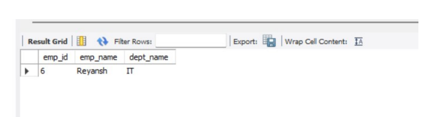
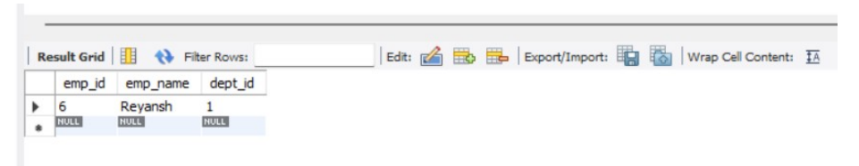
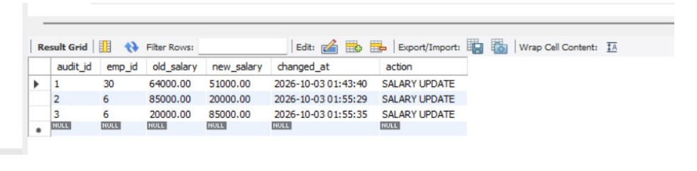

# DBMS Experiment – 6

## Stored Procedures, Triggers, Validation and Audit Logging

---

## 🎯 Aim

To create a stored procedure `transfer_employee(emp_id, new_dept_id)` with validation and error handling, implement triggers for salary validation and audit logging, and test important edge cases.

## 📌 Objectives

- Create a stored procedure to transfer employees between departments.
- Validate employee and department IDs before transferring.
- Implement transaction control and error handling.
- Validate employee salaries using triggers.
- Maintain an audit log whenever an employee's salary changes.
- Test successful and invalid operations.

## 🗄️ Database Used

**Database:** `CompanyDB`

**Tables used:**
- `Employee`
- `Department`
- `Employee_Salary_Audit`

```sql
USE CompanyDB;
```

---

## 💻 SQL Queries and Outputs

### 1. Create Salary Audit Table

This table stores the old and new salary values whenever an employee's salary changes.

```sql
CREATE TABLE IF NOT EXISTS Employee_Salary_Audit (
    audit_id INT AUTO_INCREMENT PRIMARY KEY,
    emp_id INT NOT NULL,
    old_salary DECIMAL(10,2),
    new_salary DECIMAL(10,2),
    changed_at TIMESTAMP DEFAULT CURRENT_TIMESTAMP,
    action VARCHAR(30)
);
```

### 📸 Output Screenshot


---

### 2. Salary Validation Trigger

The trigger rejects salaries below ₹30,000 or above ₹1,50,000 before inserting an employee.

```sql
DELIMITER //

CREATE TRIGGER validate_employee_salary
BEFORE INSERT ON Employee
FOR EACH ROW
BEGIN
    IF NEW.salary < 30000 OR NEW.salary > 150000 THEN
        SIGNAL SQLSTATE '45000'
        SET MESSAGE_TEXT =
        'Salary must be between 30000 and 150000';
    END IF;
END//

DELIMITER ;
```

### 📸 Output Screenshot


---

### 3. Salary Update Validation Test

Test an invalid salary update:

```sql
UPDATE Employee
SET salary = 20000
WHERE emp_id = 6;
```

Test a valid salary update:

```sql
UPDATE Employee
SET salary = 85000
WHERE emp_id = 6;
```

**Expected validation error:**

```text
Salary must be between 30000 and 150000
```

> Note: The PDF provides a `BEFORE INSERT` validation trigger but does not include the corresponding `BEFORE UPDATE` trigger definition. The invalid UPDATE test requires that additional trigger to reject the update.

---

### 4. Salary Audit Trigger

This trigger records salary changes after an employee's salary is updated successfully.

```sql
DELIMITER //

CREATE TRIGGER audit_salary_update
AFTER UPDATE ON Employee
FOR EACH ROW
BEGIN
    IF OLD.salary <> NEW.salary THEN
        INSERT INTO Employee_Salary_Audit
        (emp_id, old_salary, new_salary, action)
        VALUES
        (NEW.emp_id, OLD.salary, NEW.salary, 'SALARY UPDATE');
    END IF;
END//

DELIMITER ;
```

Verify the audit records:

```sql
SELECT audit_id, emp_id, old_salary, new_salary,
       changed_at, action
FROM Employee_Salary_Audit
ORDER BY audit_id;
```

### 📸 Output Screenshot


---

### 5. Stored Procedure – Transfer Employee

The procedure validates employee and department IDs, checks whether the employee is already in the requested department, and uses transaction control.

```sql
DELIMITER //

CREATE PROCEDURE transfer_employee(
    IN p_emp_id INT,
    IN p_new_dept_id INT
)
BEGIN
    DECLARE v_emp_count INT DEFAULT 0;
    DECLARE v_dept_count INT DEFAULT 0;
    DECLARE v_old_dept_id INT;

    DECLARE EXIT HANDLER FOR SQLEXCEPTION
    BEGIN
        ROLLBACK;
        RESIGNAL;
    END;

    START TRANSACTION;

    SELECT COUNT(*) INTO v_emp_count
    FROM Employee
    WHERE emp_id = p_emp_id;

    IF v_emp_count = 0 THEN
        SIGNAL SQLSTATE '45000'
        SET MESSAGE_TEXT = 'Employee does not exist';
    END IF;

    SELECT COUNT(*) INTO v_dept_count
    FROM Department
    WHERE dept_id = p_new_dept_id;

    IF v_dept_count = 0 THEN
        SIGNAL SQLSTATE '45000'
        SET MESSAGE_TEXT = 'Department does not exist';
    END IF;

    SELECT dept_id INTO v_old_dept_id
    FROM Employee
    WHERE emp_id = p_emp_id;

    IF v_old_dept_id = p_new_dept_id THEN
        SIGNAL SQLSTATE '45000'
        SET MESSAGE_TEXT =
        'Employee is already in this department';
    END IF;

    UPDATE Employee
    SET dept_id = p_new_dept_id
    WHERE emp_id = p_emp_id;

    COMMIT;
END//

DELIMITER ;
```

### 6. Test Successful Employee Transfer

Transfer employee 6 to department 4.

```sql
CALL transfer_employee(6, 4);

SELECT e.emp_id, e.emp_name, d.dept_name
FROM Employee e
JOIN Department d ON e.dept_id = d.dept_id
WHERE e.emp_id = 6;
```

### 📸 Output Screenshot



---

### 7. Test Edge Cases

**Invalid employee ID**

```sql
CALL transfer_employee(99, 4);
```

**Invalid department ID**

```sql
CALL transfer_employee(6, 99);
```

**Employee already in the same department**

```sql
CALL transfer_employee(6, 4);
```

These tests check whether the procedure correctly rejects invalid transfers.

### 📸 Output Screenshot



---

### 8. Test Salary Validation

Attempt to update an employee's salary with an invalid value.

```sql
UPDATE Employee
SET salary = 20000
WHERE emp_id = 6;
```

Expected error:

```text
ERROR 1644 (45000):
Salary must be between 30000 and 150000
```

Now test a valid salary:

```sql
UPDATE Employee
SET salary = 85000
WHERE emp_id = 6;
```

### 📸 Output Screenshot


---

### 9. Verify Salary Audit Log

Display all recorded salary changes.

```sql
SELECT audit_id, emp_id, old_salary, new_salary,
       changed_at, action
FROM Employee_Salary_Audit
ORDER BY audit_id;
```

### 📸 Output Screenshot



---

## 📚 Concepts Demonstrated

1. Stored procedures and parameters.
2. Triggers and automatic validation.
3. Transaction management using `START TRANSACTION`, `COMMIT`, and `ROLLBACK`.
4. Error handling using `SIGNAL` and `RESIGNAL`.
5. Salary audit logging.
6. Validation of employee and department IDs.
7. Testing successful and unsuccessful operations.

## ✅ Result

The `transfer_employee` stored procedure was created with validation, transaction control, and error handling. Salary validation and audit triggers were implemented, and important edge cases were tested.

## 📝 Conclusion

Stored procedures help perform controlled database operations, while triggers enforce validation rules and automatically maintain an audit trail. Together, they improve data integrity, consistency, and reliability in database management.

---

**Repository files**

- `exp06.sql` — SQL source code
- `readme6.md` — Experiment documentation
- `images-exp-6/` — Output screenshots
